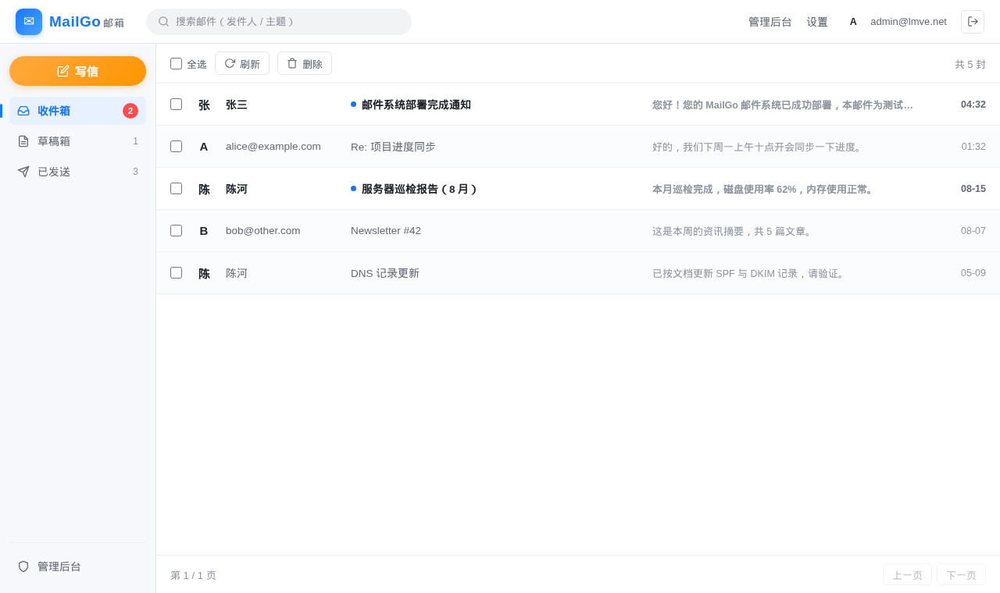
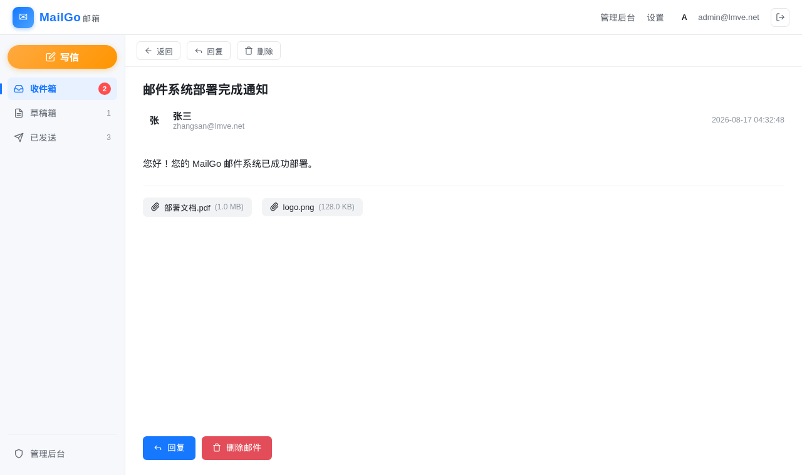
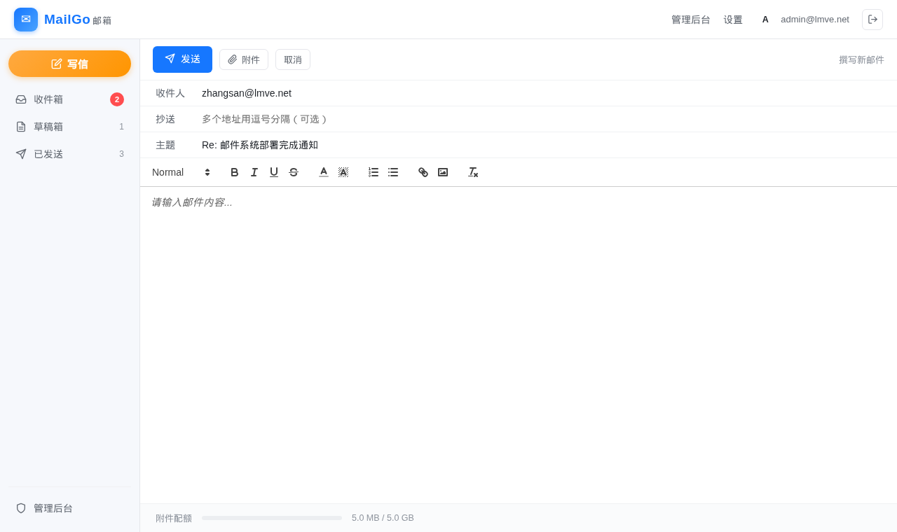
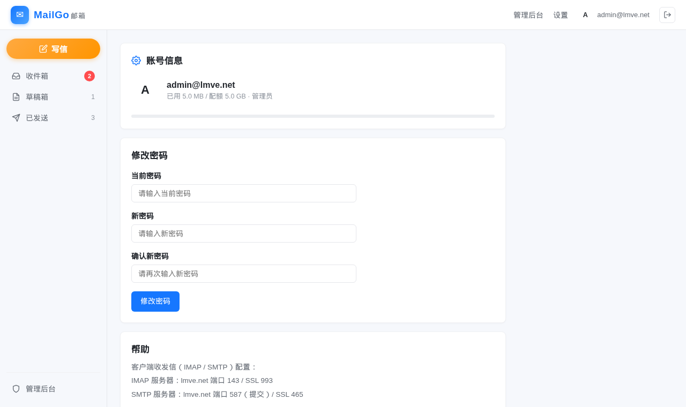

# MailGo

> [English](README.md) | 中文

Go 语言编写的轻量级邮件系统，集成 SMTP / IMAP / POP3 协议服务和 Web 管理界面。
Web 前端的布局：顶部导航 + 左侧文件夹栏 + 邮件列表三栏设计。

## 功能特性

- **邮件协议**：SMTP（发送）、IMAP（同步）、POP3（收取），均支持 TLS 加密
- **外部投递**：认证用户可向外部邮箱（Gmail/Outlook 等）发送邮件，内置外发队列、**并发 worker 池投递**（默认 4 线程 + 每收件域并发上限 2）、MX 直投、STARTTLS、指数退避重试、退信通知与 DKIM 签名
- **多语言界面（i18n）**：中文 / 英文 / 日文，在「设置」页可选择界面语言（或自动跟随浏览器 Accept-Language，英语兜底），覆盖全部用户页与管理后台、12 小时制时间与错误提示
- **Web 邮箱**：文件夹数据驱动（Web 与 IMAP 共享 MailboxService，IMAP LIST 返回什么界面就显示什么），系统文件夹（收件箱 / 已发送 / 草稿箱 / 垃圾箱）与自定义文件夹管理、删除邮件移入垃圾箱（支持恢复 / 彻底删除 / 清空）、未读角标与搜索过滤、全选 / 批量删除、发件人头像、富文本编辑（Quill.js）、附件上传/下载
- **管理后台**：域名管理、用户管理、DKIM 密钥自动生成、DNS 配置提示、全量邮件查看、外发队列管理、IP 封禁管理、仪表盘统计、时间统一按 Web 时区显示 12 小时制（上午/下午）
- **协议调用日志**：SMTP / IMAP / POP3 每次连接自动记录来源 IP、用户名、成功/失败、失败原因与操作摘要，可按协议/状态/IP/用户名/时间筛选，用于分析密码爆破、中继滥用等攻击行为（默认保留 30 天，自动清理）
- **IMAP 新邮件推送**：本地投递（SMTP/Web 写信）成功后实时推送，挂起 IDLE 的客户端即时收到新邮件通知（无需轮询）；其他客户端造成的已读/星标/删除变化也实时同步（IMAP STORE/EXPUNGE、POP3 删除、Web 标已读/删除）
- **当前连接监控**：管理后台实时查看 SMTP/IMAP/POP3 活动连接（来源 IP、用户名、TLS、时长），每 5 秒自动刷新；支持「断开并封禁」一键封禁该 IP 全部在线连接（封禁 180 天，可随时解封）
- **外部认证**：OAuth2（Google / GitHub）、LDAP（可选，默认关闭）
- **安全机制**：BCrypt 密码哈希、登录失败自动封禁 IP（**阶段性封禁**：前 3 次达到失败阈值只计数，第 4 次起封禁并按档位递增 30分钟 → 3小时 → 3个月 → 半年，成功登录清零；**枚举爆破无宽限**：用户名不存在的失败跳过宽限、首次触发即封禁）、外发频率限制（防滥用）、非认证禁止中继（防开放中继）、管理员可解封
- **多数据库**：默认 SQLite，可切换 MySQL
- **跨平台**：Linux 生产部署 + Windows 本地调试

## 界面预览

| 收件箱 | 邮件阅读 |
|--------|----------|
|  |  |

| 写信 | 设置 | 登录 |
|------|------|------|
|  |  |  |

> 截图使用演示数据渲染，实际界面以部署为准。

## 快速开始

### 编译

```bash
go build -o mailgo .
```

### 启动

```bash
./mailgo
```

首次启动会自动创建配置文件和数据库，默认管理员账户：

| 项目 | 值 |
|------|-----|
| 邮箱 | `admin@example.com` |
| 初始密码 | 随机生成（16 位，数字+大小写字母），仅在启动日志中打印一次；也可用环境变量 `MAILGO_ADMIN_PASSWORD` 预先指定 |

> ⚠️ 该账户已标记「首次登录必须修改密码」，登录后请在 设置 页面立即改密。

### 访问

| 页面 | 地址 |
|------|------|
| 用户邮箱 | `http://localhost:8080/` |
| 管理后台 | `http://localhost:8080/admin` |

---

## 配置文件

配置文件路径（TOML 格式）：

| 系统 | 路径 |
|------|------|
| Linux | `/etc/mail_go/mail_go.toml` |
| Windows | `./win/etc/mail_go/mail_go.toml` |

首次启动自动生成，缺失字段自动补全。修改后需重启服务生效。

### 完整配置参考

```toml
[database]
driver = "sqlite"                          # sqlite | mysql
dsn = "/srv/mail_go/mail.db"               # SQLite: 文件路径; MySQL: DSN 连接串

[storage]
base_dir = "/srv/mail_go"                  # 数据根目录
attach_dir = "/srv/mail_go/attachments"     # 附件存储目录

[web]
addr = ":8080"                             # 监听地址，支持 TCP 端口或 Unix socket
secret_key = ""                             # Web 会话签名密钥；留空时首次启动自动生成
                                           # 随机密钥并写入本文件（请妥善备份，泄露/丢失
                                           # 分别意味着会话可被伪造/所有登录态失效）
cookie_secure = true                        # 会话 cookie 仅通过 HTTPS 传输（Secure 标志）；
                                           # 仅本地 HTTP 调试时才改为 false
protocol_log_keep_days = 30                # SMTP/IMAP/POP3 协议调用日志保留天数，
                                           # 超出后由后台任务自动清理；0 表示不清理

[smtp]
addr = ":25"                               # SMTP 明文端口
tls_addr = ":465"                          # SMTPS 端口（需配置 TLS 证书）
domain = "example.com"                     # 邮件域名
tls_cert = ""                             # TLS 证书路径（留空则不启用 TLS）
tls_key = ""                              # TLS 私钥路径
max_message_bytes = 67108864              # 单封邮件最大 64MB

[imap]
addr = ":143"                              # IMAP 明文端口
tls_addr = ":993"                          # IMAPS 端口
tls_cert = ""
tls_key = ""

[pop3]
addr = ":110"                              # POP3 明文端口
tls_addr = ":995"                          # POP3S 端口
tls_cert = ""
tls_key = ""

[auth]
oauth2_enabled = false                     # 是否启用 OAuth2 登录
oauth2_provider = ""                       # google | github
oauth2_client_id = ""
oauth2_client_secret = ""
oauth2_redirect_url = ""
ldap_enabled = false                      # 是否启用 LDAP 登录
ldap_server = ""                          # 例: ldap://localhost:389
ldap_bind_dn = ""                         # 例: cn=admin,dc=example,dc=com
ldap_bind_password = ""
ldap_search_base = ""                     # 例: ou=users,dc=example,dc=com
ldap_search_filter = ""                   # 例: (uid=%s)
ldap_use_tls = false

[ban]
max_fail_attempts = 5                    # 登录失败次数阈值
ban_duration_min = 30                     # 第 1 次封禁时长（分钟）；之后按档位递增：
                                           # 第 2 次 3 小时 → 第 3 次 3 个月 → 第 4 次起半年（上限）
                                           # 前 3 次达到阈值只计数不封禁，成功登录后清零

[caddy]
data_dir = ""                             # Caddy 数据目录（含 certificates/ 的那个），
                                          # 供后台一键导入证书；留空自动探测
                                          # /var/lib/caddy/.local/share/caddy 等常见位置

[outbound]
hostname = ""                            # EHLO 主机名，留空使用 [smtp] domain
poll_interval = 15                       # 外发队列扫描间隔（秒）
workers = 4                              # 并发投递 worker 数（多线程并行发送，
                                         # 大量邮件时吞吐提升；0/1 为串行）
batch_size = 50                          # 每次扫描最多取出的待投递邮件数
max_concurrent_per_domain = 2            # 同一收件域（或中继）的最大并发连接数，
                                         # 防被判定为滥发；0 表示不限制
max_attempts = 12                        # 单封邮件最大投递尝试次数
retry_base_min = 5                       # 重试退避基数（分钟），指数增长：5/10/20/40...
max_recipients = 50                      # 单封邮件最大外部收件人数
max_per_min = 30                         # 每用户每分钟最大外发数
max_per_day = 500                        # 每用户每日最大外发数，0 表示禁用外部投递
connect_timeout = 30                     # 连接远程 MX 超时（秒）
relay_host = ""                          # 智能主机（smarthost），留空则直投 MX
relay_port = 587                         # 465 = 隐式 TLS，其他端口按需 STARTTLS
relay_user = ""                          # 中继认证用户名（AUTH PLAIN）
relay_password = ""                      # 中继认证密码
relay_starttls = true                    # 非 465 端口是否使用 STARTTLS
relay_tls_insecure = false                # 是否跳过中继服务器 TLS 证书验证；
                                          # 默认验证证书（保护中继凭据），仅自签证书
                                          # 内网中继且明确知晓风险时才改为 true
ip_family = "ipv4"                       # 出站地址族：ipv4（默认）| ipv6 | auto
source_ip = ""                           # 出站源地址绑定（如静态 IPv6 地址），留空由内核选择
```

---

## 常见配置场景

### 1. 切换到 MySQL

```toml
[database]
driver = "mysql"
dsn = "mailgo:YourPassword@tcp(127.0.0.1:3306)/mailgo?charset=utf8mb4&parseTime=True&loc=Local"
```

MySQL DSN 格式：`用户名:密码@tcp(主机:端口)/数据库名?参数`

> 数据库和用户需提前在 MySQL 中创建：
> ```sql
> CREATE DATABASE mailgo CHARACTER SET utf8mb4 COLLATE utf8mb4_unicode_ci;
> CREATE USER 'mailgo'@'localhost' IDENTIFIED BY 'YourPassword';
> GRANT ALL PRIVILEGES ON mailgo.* TO 'mailgo'@'localhost';
> FLUSH PRIVILEGES;
> ```

### 2. Web 使用 Unix Socket

```toml
[web]
addr = "/run/mail_go/web.sock"
```

当 `addr` 以 `/` 开头时，Gin 自动以 Unix socket 方式监听。

### 3. 指定会话密钥（容器/多实例部署）

会话签名密钥可通过环境变量 `MAILGO_SECRET_KEY` 覆盖（优先于配置文件，且不会写入磁盘）：

```bash
MAILGO_SECRET_KEY="$(openssl rand -hex 32)" mail_go
```

要求：长度至少 16 字节；留空时由配置文件提供（首次启动自动生成）。更换密钥后所有已登录会话立即失效，用户需重新登录。

Nginx 反向代理配置：

```nginx
server {
    listen 80;
    server_name mail.example.com;

    location / {
        proxy_pass http://unix:/run/mail_go/web.sock;
        proxy_set_header Host $host;
        proxy_set_header X-Real-IP $remote_addr;
        proxy_set_header X-Forwarded-For $proxy_add_x_forwarded_for;
        proxy_set_header X-Forwarded-Proto $scheme;
    }
}
```

> 确保 socket 目录存在并有写权限：
> ```bash
> mkdir -p /run/mail_go
> chown mailgo:mailgo /run/mail_go
> ```

### 3. 启用 TLS 加密

为 SMTP/IMAP/POP3 启用 TLS（三个协议共享同一证书，或分别配置）：

```toml
[smtp]
tls_cert = "/etc/mail_go/certs/server.crt"
tls_key = "/etc/mail_go/certs/server.key"

[imap]
tls_cert = "/etc/mail_go/certs/server.crt"
tls_key = "/etc/mail_go/certs/server.key"

[pop3]
tls_cert = "/etc/mail_go/certs/server.crt"
tls_key = "/etc/mail_go/certs/server.key"
```

配置 TLS 后，系统会自动启动对应的加密端口（465/993/995）。管理后台添加域名时勾选 TLS 会自动切换端口号。

> 可用 Let's Encrypt 获取免费证书：
> ```bash
> certbot certonly --standalone -d mail.example.com
> # 证书路径: /etc/letsencrypt/live/mail.example.com/fullchain.pem
> # 私钥路径: /etc/letsencrypt/live/mail.example.com/privkey.pem
> ```

#### 从 Caddy 一键导入证书

如果本机已用 [Caddy](https://caddyserver.com/) 托管该域名 HTTPS（Caddy 会自动签发并续期证书），
可在管理后台 **域名管理 → 编辑域名** 页面点击 **“从 Caddy 获取证书”** 按钮，
一键把 Caddy 存储中的证书与私钥导入邮件服务（自动启用该域名的 TLS），无需手动复制 PEM 文件。
支持通配符证书（如 `*.example.com` 可匹配 `mail.example.com`）。
证书支持**热加载**：导入（或手动上传）后立即生效，无需重启服务——SMTP/IMAP/POP3
每次 TLS 握手会自动检查并重载变化的证书文件。

由于 Caddy 的证书目录仅 `caddy` 用户可读，install.sh 会安装一个 root 权限的证书同步任务
（`mailgo-caddy-sync.{path,timer}`），把 Caddy 证书树镜像到 `/srv/mail_go/tls/caddy`，
证书续期后自动同步，mail_go 始终可读；另外还会授予 ACL 权限作为直接读取的兜底。
安装时自动配置，也可手动执行：

```bash
sudo ./install.sh setup-caddy-cert          # 自动探测 Caddy 数据目录并配置同步 + ACL
sudo ./install.sh setup-caddy-cert /path/to/caddy/data   # 或手动指定数据目录
```

若 Caddy 数据目录不在常见位置，可在配置文件中显式指定：

```toml
[caddy]
data_dir = "/var/lib/caddy/.local/share/caddy"
```

### 4. 启用 OAuth2 登录（Google 示例）

```toml
[auth]
oauth2_enabled = true
oauth2_provider = "google"
oauth2_client_id = "your-client-id.apps.googleusercontent.com"
oauth2_client_secret = "your-client-secret"
oauth2_redirect_url = "https://mail.example.com/auth/oauth2/callback"
```

> 需要在 [Google Cloud Console](https://console.cloud.google.com/) 创建 OAuth 2.0 客户端，授权回调地址填 `https://你的域名/auth/oauth2/callback`。

### 5. 启用 LDAP 认证

```toml
[auth]
ldap_enabled = true
ldap_server = "ldap://ldap.example.com:389"
ldap_bind_dn = "cn=admin,dc=example,dc=com"
ldap_bind_password = "ldap_admin_password"
ldap_search_base = "ou=users,dc=example,dc=com"
ldap_search_filter = "(uid=%s)"
ldap_use_tls = true
```

### 6. 对外发送邮件（外部投递）

认证用户（Web 邮箱 / SMTP 提交）可以向外部邮箱地址发送邮件。系统通过
收件人域名的 MX 记录直投，自动处理 STARTTLS、指数退避重试，并为外发
邮件添加 DKIM 签名（使用后台域名管理中生成的密钥）。

```toml
[smtp]
domain = "example.com"        # 必须设置为真实的邮件域名（EHLO/退信地址）

[outbound]
hostname = "mail.example.com" # 建议与邮件主机名一致
poll_interval = 15
max_attempts = 12
max_per_day = 500             # 设为 0 可完全禁用外部投递
```

需要满足的 DNS / 服务器条件（详见 `todo.md` 与后台 DNS 提示页）：

| 项目 | 说明 |
|------|------|
| MX | `example.com MX 10 mail.example.com` |
| SPF | `example.com TXT "v=spf1 mx -all"` |
| DKIM | `default._domainkey.example.com TXT "v=DKIM1; k=rsa; p=<公钥>"`（后台自动生成） |
| DMARC | `_dmarc.example.com TXT "v=DMARC1; p=none; rua=mailto:postmaster@example.com"` |
| PTR | 服务器 IP 反向解析指向邮件主机名（需向机房申请） |
| 网络 | 服务器 25 端口出站未被云厂商封锁 |

安全策略：外部收件人仅接受已认证用户；`MAIL FROM` 必须与登录用户一致；
每用户每分钟/每日外发数受限；失败邮件会退信到发件人收件箱；
管理员可在后台「外发队列」查看投递状态、手动重试或取消。

> **IPv4/IPv6**：默认仅使用 IPv4 出站（`ip_family = "ipv4"`），因为很多收件方
> （如 Gmail）会拒收没有 PTR 的 IPv6 地址，而 IPv4 通常具备正反向一致的 PTR。
> 如需走 IPv6：请运营商为静态地址配置 PTR（指向 `mail.example.com`），
> 然后设置 `ip_family = "ipv6"` 并把 `source_ip` 绑定到该静态地址
> （避免内核使用轮换的临时隐私地址）。

### 7. 通过智能主机（smarthost）中继外发

服务器 IP 属于家庭宽带/动态 IP 段时，常被 Spamhaus PBL 等策略列表收录，
Microsoft（Outlook/Hotmail）等收件方会直接拒收。此时建议把外发邮件交给
第三方 SMTP 中继（Mailgun / SendGrid / Amazon SES / 阿里云邮件推送等），
在 `[outbound]` 中配置即可，所有外部投递自动改走中继：

```toml
[outbound]
relay_host = "smtp.example-relay.com"
relay_port = 587          # 465 为隐式 TLS
relay_user = "your-api-user"
relay_password = "your-api-key"
relay_starttls = true
```

中继使用 AUTH PLAIN 认证；本地收件人仍走本地投递，不受影响。

### 8. 指定初始管理员密码

首次启动创建管理员账户时，初始密码默认随机生成并仅在启动日志中打印一次；
如需预先指定（例如部署脚本），可设置环境变量 `MAILGO_ADMIN_PASSWORD`：

```bash
MAILGO_ADMIN_PASSWORD="$(openssl rand -base64 12)" ./mailgo
```

该变量仅在首次创建管理员账户时生效（账户已存在则忽略）；无论哪种方式，
首次登录都会强制修改密码。

---

## 端口速查

| 协议 | 明文端口 | TLS 端口 | 说明 |
|------|---------|---------|------|
| SMTP | 25 | 465 | 邮件发送 |
| IMAP | 143 | 993 | 邮箱同步 |
| POP3 | 110 | 995 | 邮件收取 |
| Web | 8080 | — | Web 界面（可配 Unix socket） |

---

## 目录结构

```
mailgo/
├── main.go                          # 程序入口
├── config/
│   ├── config.go                    # 配置加载与合并
│   └── defaults.go                  # 默认常量
├── internal/
│   ├── db/
│   │   ├── db.go                    # 数据库初始化（SQLite/MySQL）
│   │   └── models.go               # GORM 模型定义
│   ├── store/
│   │   ├── stores.go                # Store 聚合器
│   │   ├── user_store.go            # 用户数据操作
│   │   ├── mail_store.go            # 邮件数据操作
│   │   ├── mailbox_store.go         # 文件夹（IMAP mailbox）数据操作
│   │   ├── domain_store.go          # 域名数据操作
│   │   ├── attachment_store.go      # 附件数据操作
│   │   ├── outbound_store.go        # 外发队列数据操作
│   │   ├── ban_store.go             # 封禁数据操作
│   │   └── protocol_log_store.go    # 协议调用日志数据操作
│   ├── smtp_server/server.go        # SMTP 服务
│   ├── outbound/
│   │   ├── mailer.go               # MX 查询与 SMTP 出站客户端
│   │   ├── manager.go              # 外发队列、重试、限速、退信
│   │   └── sign.go                 # DKIM 签名
│   ├── imap_server/
│   │   ├── server.go                # IMAP 服务（监听器/能力/跨会话推送）
│   │   ├── service.go               # MailboxService（IMAP 会话与 Web 共享）
│   │   └── session.go               # IMAP Session 实现（SELECT/FETCH/STORE/EXPUNGE）
│   ├── pop3_server/server.go         # POP3 服务
│   ├── connhub/hub.go                # 协议连接注册中心（当前连接监控）
│   ├── storage/attachment.go         # 附件文件存储
│   ├── dkim/keys.go                  # DKIM 密钥生成
│   ├── auth/
│   │   ├── provider.go              # 认证接口
│   │   ├── oauth2.go                # OAuth2 认证
│   │   └── ldap.go                  # LDAP 认证
│   └── web/
│       ├── server.go                 # Web 路由与模板加载
│       ├── handlers/
│       │   ├── auth.go              # 登录/登出/OAuth2/LDAP
│       │   ├── mail.go              # 邮箱操作
│       │   └── admin.go             # 管理后台
│       ├── middleware/
│       │   ├── auth.go              # 会话认证
│       │   ├── admin.go             # 管理员权限
│       │   └── ban.go               # IP 封禁检查
│       └── templates/               # HTML 模板
│           ├── *.html               # 用户页面
│           └── admin/*.html          # 管理页面
└── .gitignore
```

### 运行时数据目录（Linux）

| 路径 | 说明 |
|------|------|
| `/etc/mail_go/` | 配置文件 |
| `/srv/mail_go/` | 数据库 + 附件存储 |

### 运行时数据目录（Windows 调试）

| 路径 | 说明 |
|------|------|
| `./win/etc/mail_go/` | 配置文件 |
| `./win/srv/mail_go/` | 数据库 + 附件存储 |

---

## Linux 服务部署

### systemd 服务文件

创建 `/etc/systemd/system/mailgo.service`：

```ini
[Unit]
Description=MailGo Mail Server
After=network.target mysql.service

[Service]
Type=simple
User=mailgo
Group=mailgo
WorkingDirectory=/opt/mailgo
ExecStart=/opt/mailgo/mailgo
Restart=on-failure
RestartSec=5
LimitNOFILE=65536

# 安全加固
NoNewPrivileges=true
ProtectSystem=strict
ProtectHome=true
ReadWritePaths=/srv/mail_go /run/mail_go /etc/mail_go

[Install]
WantedBy=multi-user.target
```

### 启动服务

```bash
# 创建系统用户
sudo useradd -r -s /sbin/nologin -d /srv/mail_go mailgo

# 设置目录权限
sudo chown -R mailgo:mailgo /srv/mail_go /etc/mail_go

# 启用并启动
sudo systemctl daemon-reload
sudo systemctl enable mailgo
sudo systemctl start mailgo

# 查看日志
sudo journalctl -u mailgo -f
```

---

## DNS 配置

邮件服务需要以下 DNS 记录（管理后台 → DNS 提示 页面可查看完整配置）：

| 记录类型 | 名称 | 值 | 说明 |
|---------|------|-----|------|
| A | mail | 服务器 IP | 邮件服务器地址 |
| MX | @ | mail.example.com | 邮件路由 |
| TXT | @ | `v=spf1 mx ~all` | SPF 反垃圾 |
| TXT | default._domainkey | DKIM 公钥（后台自动生成） | DKIM 签名验证 |
| TXT | _dmarc | `v=DMARC1; p=none; rua=mailto:admin@example.com` | DMARC 策略 |

---

## 技术栈

| 组件 | 技术 |
|------|------|
| 语言 | Go 1.25+ |
| Web 框架 | Gin |
| 模板引擎 | html/template |
| ORM | GORM |
| 数据库 | SQLite（默认）/ MySQL |
| 配置格式 | TOML |
| SMTP | github.com/emersion/go-smtp |
| IMAP | github.com/emersion/go-imap/v2 |
| POP3 | 手工实现 TCP 协议 |
| 密码哈希 | golang.org/x/crypto/bcrypt |
| 富文本 | Quill.js（go:embed 内嵌，离线可用） |
| OAuth2 | golang.org/x/oauth2 |
| LDAP | github.com/go-ldap/ldap/v3 |
| DKIM | RSA 2048 自动生成 |

---

## 默认账户

| 角色 | 邮箱 | 初始密码 | 默认配额 |
|------|------|---------|---------|
| 管理员 | admin@example.com | 随机生成（启动日志打印一次）或 `MAILGO_ADMIN_PASSWORD` 指定 | 5 GB |

> ⚠️ 首次登录强制修改密码（管理员重置密码同样触发）；部署到生产环境后请立即完成改密。

## License

MIT
