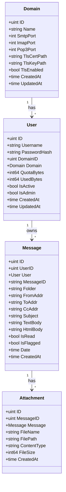
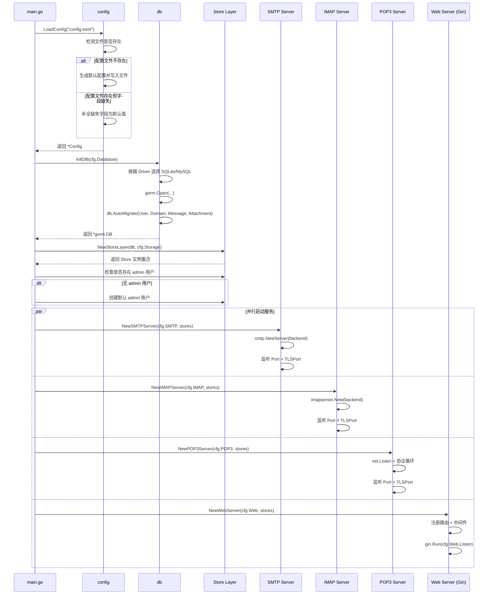
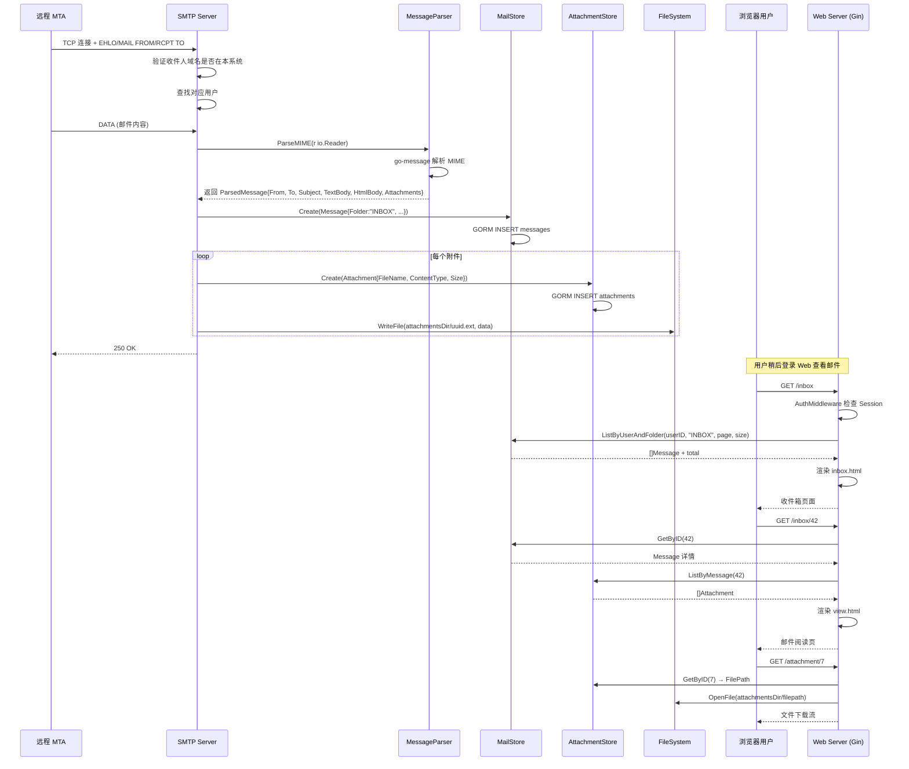
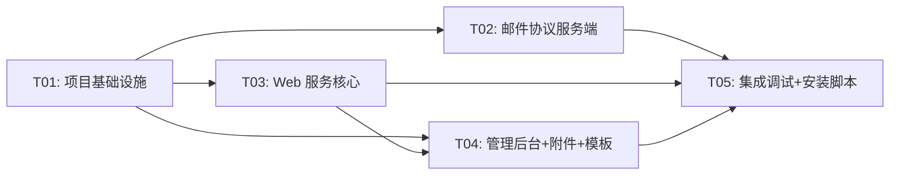

# MailGo 系统设计文档

> **项目**：mail_go —— 自托管 Go 邮件系统  
> **架构师**：高见远  
> **版本**：v1.0  
> **日期**：2025-07

---

## 1. 实现方案分析

### 1.1 核心技术挑战

| 挑战 | 说明 | 应对策略 |
|------|------|----------|
| SMTP/IMAP/POP3 三协议并行 | 三个邮件协议服务需同时运行、共享同一套用户与邮件数据 | 统一 Backend 接口层，三个协议服务均委托给同一 `MailStore` + `UserStore` |
| 邮件解析与持久化 | go-message 解析 MIME 后需拆分为元数据 + 正文 + 附件 | 统一 `MessageParser` 服务，解析后原子写入 DB + 文件系统 |
| IMAP 文件夹/标记/搜索 | go-imap/v2 需实现完整的 Backend / User / Mailbox / Message 接口 | 采用"数据库为单一真相源"架构，IMAP 操作全部映射到 GORM 查询 |
| 跨平台路径 | Linux/Windows 配置与数据路径不同 | `config` 层根据 `runtime.GOOS` 自动映射路径前缀 |
| 附件存储一致性 | 附件写入文件系统后需与 DB 记录对齐 | 事务内写 DB + 事后写文件，失败时异步清理孤儿文件 |
| Web 认证与权限 | 普通用户 vs 管理员，Session 管理 | Gin 中间件：`AuthMiddleware`（登录检查）+ `AdminMiddleware`（管理员检查） |

### 1.2 框架与库选型

| 组件 | 选型 | 理由 |
|------|------|------|
| SMTP 服务端 | `github.com/emersion/go-smtp` | PRD 指定，成熟稳定 |
| IMAP 服务端 | `github.com/emersion/go-imap/v2` | PRD 指定，v2 API 更现代 |
| POP3 服务端 | 手工实现（TCP 监听 + 文本协议） | emersion 系列无官方 go-pop3，POP3 协议简单，自实现可控 |
| 邮件解析 | `github.com/emersion/go-message` | 与 go-smtp/go-imap 生态一致 |
| Web 框架 | `gin-gonic/gin` | PRD 指定，高性能 |
| 模板引擎 | `html/template` | Go 标准库，自动转义防 XSS |
| ORM | `gorm.io/gorm` + `gorm.io/driver/sqlite` + `gorm.io/driver/mysql` | PRD 指定，双数据库支持 |
| 配置解析 | `github.com/BurntSushi/toml` | TOML 格式标准库 |
| 密码哈希 | `golang.org/x/crypto/bcrypt` | PRD 指定 |
| UUID | `github.com/google/uuid` | PRD 指定，用于附件文件名等 |
| Session | `github.com/gin-contrib/sessions` + cookie store | 轻量，无需 Redis |

### 1.3 架构模式

采用 **分层架构 + 共享 Store 层**：

```
┌──────────────────────────────────────────────┐
│              main.go (启动入口)                │
├──────────┬──────────┬──────────┬───────────────┤
│ SMTP     │ IMAP     │ POP3     │  Web (Gin)   │
│ Server   │ Server   │ Server   │  Router      │
├──────────┴──────────┴──────────┴───────────────┤
│              Store Layer (共享)                 │
│  UserStore │ MailStore │ DomainStore │ AttachmentStore │
├────────────────────────────────────────────────┤
│              GORM (SQLite / MySQL)             │
└────────────────────────────────────────────────┘
```

- **协议层**（SMTP/IMAP/POP3）仅负责协议握手，业务逻辑委托 Store 层
- **Web 层**（Gin + html/template）负责 UI 渲染和 HTTP API
- **Store 层**封装所有数据库操作，是唯一的数据访问入口
- **Config** 在启动时加载为全局单例，通过依赖注入传递给各 Server

---

## 2. 项目文件列表

```
mail_go/
├── main.go                           # 程序入口：配置加载 → DB 初始化 → 各服务启动
├── go.mod                            # Go 模块定义
├── go.sum                            # 依赖校验
├── config/
│   ├── config.go                     # 配置结构体 + 加载 + 自动补全逻辑
│   └── defaults.go                  # 默认值常量（端口、路径等）
├── internal/
│   ├── db/
│   │   ├── db.go                     # GORM 初始化 + AutoMigrate
│   │   └── models.go                 # User / Domain / Message / Attachment 模型
│   ├── store/
│   │   ├── user_store.go             # 用户 CRUD + 认证
│   │   ├── mail_store.go             # 邮件 CRUD + 文件夹查询
│   │   ├── domain_store.go           # 域名 CRUD
│   │   └── attachment_store.go       # 附件元数据 CRUD
│   ├── smtp_server/
│   │   └── server.go                 # SMTP 服务端（go-smtp Backend 实现）
│   ├── imap_server/
│   │   ├── server.go                 # IMAP 服务端启动（监听器/能力/跨会话推送）
│   │   └── session.go                # go-imap/v2 imapserver.Session 实现
│   ├── pop3_server/
│   │   └── server.go                 # POP3 服务端（TCP 监听 + 文本协议）
│   ├── web/
│   │   ├── server.go                 # Gin 引擎初始化 + 路由注册
│   │   ├── middleware/
│   │   │   ├── auth.go               # 登录认证中间件
│   │   │   └── admin.go              # 管理员鉴权中间件
│   │   ├── handlers/
│   │   │   ├── auth.go               # 登录/登出处理
│   │   │   ├── mail.go               # 收件箱/发件箱/撰写/查看
│   │   │   └── admin.go              # 管理后台处理
│   │   └── templates/
│   │       ├── base.html             # 基础布局模板
│   │       ├── login.html            # 登录页
│   │       ├── inbox.html            # 收件箱
│   │       ├── compose.html          # 撰写邮件
│   │       ├── sent.html             # 发件箱
│   │       ├── view.html             # 邮件阅读
│   │       └── admin/
│   │           ├── dashboard.html    # 管理首页
│   │           ├── domains.html      # 域名管理
│   │           └── users.html        # 用户管理
│   └── storage/
│       └── attachment.go             # 附件文件读写（磁盘操作）
├── scripts/
│   └── install.sh                    # Linux 安装脚本（创建目录、设置权限）
└── docs/
    ├── prd.md
    └── architecture.md              # 本文档
```

---

## 3. 数据结构与接口

### 3.1 数据库模型（GORM）



#### 详细字段说明

**User**

| 字段 | 类型 | 说明 |
|------|------|------|
| ID | uint | 主键 |
| Username | string | 用户名（@ 前部分） |
| PasswordHash | string | bcrypt 哈希 |
| DomainID | uint | 所属域名外键 |
| Domain | Domain | 所属域名 |
| QuotaBytes | int64 | 附件配额（字节），默认 5GB |
| UsedBytes | int64 | 已用空间（字节） |
| IsActive | bool | 是否启用 |
| IsAdmin | bool | 是否管理员 |
| CreatedAt | time.Time | 创建时间 |
| UpdatedAt | time.Time | 更新时间 |

**Domain**

| 字段 | 类型 | 说明 |
|------|------|------|
| ID | uint | 主键 |
| Name | string | 域名（如 example.com） |
| SmtpPort | int | SMTP 端口 |
| ImapPort | int | IMAP 端口 |
| Pop3Port | int | POP3 端口 |
| TlsCertPath | string | TLS 证书路径 |
| TlsKeyPath | string | TLS 私钥路径 |
| TlsEnabled | bool | 是否启用 TLS |
| CreatedAt | time.Time | 创建时间 |
| UpdatedAt | time.Time | 更新时间 |

**Message**

| 字段 | 类型 | 说明 |
|------|------|------|
| ID | uint | 主键 |
| UserID | uint | 所属用户外键 |
| User | User | 所属用户 |
| MessageID | string | RFC 2822 Message-ID |
| Folder | string | 文件夹：INBOX / Sent / Drafts / Trash |
| FromAddr | string | 发件人地址 |
| ToAddr | string | 收件人地址（逗号分隔） |
| CcAddr | string | 抄送地址（逗号分隔） |
| Subject | string | 主题 |
| TextBody | string | 纯文本正文 |
| HtmlBody | string | HTML 正文 |
| IsRead | bool | 是否已读 |
| IsFlagged | bool | 是否标记 |
| Date | time.Time | 邮件日期 |
| CreatedAt | time.Time | 入库时间 |

**Attachment**

| 字段 | 类型 | 说明 |
|------|------|------|
| ID | uint | 主键 |
| MessageID | uint | 所属邮件外键 |
| Message | Message | 所属邮件 |
| FileName | string | 原始文件名 |
| FilePath | string | 磁盘相对路径 |
| ContentType | string | MIME 类型 |
| FileSize | int64 | 文件大小（字节） |
| CreatedAt | time.Time | 创建时间 |

### 3.2 核心接口设计

#### Config 结构体

```go
// config/config.go

type Config struct {
    Database DatabaseConfig
    Storage  StorageConfig
    Web      WebConfig
    SMTP     SMTPConfig
    IMAP     IMAPConfig
    POP3     POP3Config
}

type DatabaseConfig struct {
    Driver string // "sqlite" | "mysql"
    DSN    string
}

type StorageConfig struct {
    BaseDir    string
    AttachDir  string
}

type WebConfig struct {
    Listen string // ":8080" 或 Unix socket 路径
}

type SMTPConfig struct {
    Port    int
    TLSPort int
    Cert    string
    Key     string
}

type IMAPConfig struct {
    Port    int
    TLSPort int
    Cert    string
    Key     string
}

type POP3Config struct {
    Port    int
    TLSPort int
    Cert    string
    Key     string
}
```

#### Store 接口

```go
// internal/store/

type UserStore interface {
    Create(user *models.User) error
    GetByID(id uint) (*models.User, error)
    GetByUsername(username string, domainID uint) (*models.User, error)
    GetByEmail(email string) (*models.User, error)
    Authenticate(email, password string) (*models.User, error)
    Update(user *models.User) error
    Delete(id uint) error
    List(domainID uint, page, size int) ([]models.User, int64, error)
    UpdateUsedBytes(id uint, delta int64) error
}

type MailStore interface {
    Create(msg *models.Message) error
    GetByID(id uint) (*models.Message, error)
    ListByUserAndFolder(userID uint, folder string, page, size int) ([]models.Message, int64, error)
    MarkRead(id uint) error
    MarkFlagged(id uint, flagged bool) error
    MoveToFolder(id uint, folder string) error
    Delete(id uint) error
    CountUnread(userID uint, folder string) (int64, error)
}

type DomainStore interface {
    Create(domain *models.Domain) error
    GetByID(id uint) (*models.Domain, error)
    GetByName(name string) (*models.Domain, error)
    Update(domain *models.Domain) error
    Delete(id uint) error
    List(page, size int) ([]models.Domain, int64, error)
}

type AttachmentStore interface {
    Create(att *models.Attachment) error
    ListByMessage(messageID uint) ([]models.Attachment, error)
    Delete(id uint) error
    DeleteByMessage(messageID uint) error
}
```

#### SMTP Backend 接口（go-smtp 要求）

```go
// internal/smtp_server/server.go

// 实现 go-smtp 的 Backend 接口
type smtpBackend struct {
    userStore  store.UserStore
    mailStore  store.MailStore
    domainStore store.DomainStore
    attStore   store.AttachmentStore
    storage    *storage.AttachmentStorage
}

func (b *smtpBackend) NewSession(c *smtp.Conn) (smtp.Session, error)
func (s *smtpSession) AuthPlain(username, password string) error
func (s *smtpSession) Mail(from string, opts *smtp.MailOptions) error
func (s *smtpSession) Rcpt(to string, opts *smtp.RcptOptions) error
func (s *smtpSession) Data(r io.Reader) error
func (s *smtpSession) Logout() error
```

#### IMAP Backend 接口（go-imap/v2 要求）

```go
// internal/imap_server/session.go

// 实现 go-imap/v2 的 imapserver.Session 接口
type imapSession struct {
    stores  *store.Stores
    mailStore  store.MailStore
    domainStore store.DomainStore
    attStore   store.AttachmentStore
}

func (b *imapBackend) Login(username, password string) (backend.User, error)

// imapUser 实现 backend.User
type imapUser struct {
    user  *models.User
    store *mailStoreGorm
}

func (u *imapUser) ListMailboxes(subscribed bool) ([]imap.Mailbox, error)
func (u *imapUser) GetMailbox(name string) (backend.Mailbox, error)

// imapMailbox 实现 backend.Mailbox
type imapMailbox struct {
    user   *models.User
    folder string
    store  *mailStoreGorm
}

// imapMessage 实现 backend.Message
```

---

## 4. Web 路由表

| Method | Path | Handler | 中间件 | 说明 |
|--------|------|---------|--------|------|
| GET | /login | auth.ShowLogin | — | 登录页 |
| POST | /login | auth.DoLogin | — | 登录提交 |
| POST | /logout | auth.DoLogout | Auth | 登出 |
| GET | / | mail.Inbox | Auth | 收件箱（重定向到 /inbox） |
| GET | /inbox | mail.Inbox | Auth | 收件箱列表 |
| GET | /inbox/:id | mail.View | Auth | 查看邮件 |
| GET | /compose | mail.Compose | Auth | 撰写页面 |
| POST | /compose | mail.DoSend | Auth | 发送邮件 |
| GET | /sent | mail.Sent | Auth | 发件箱 |
| GET | /sent/:id | mail.View | Auth | 查看已发送邮件 |
| POST | /mail/delete/:id | mail.Delete | Auth | 删除邮件 |
| POST | /mail/read/:id | mail.MarkRead | Auth | 标记已读 |
| GET | /attachment/:id | mail.DownloadAttachment | Auth | 下载附件 |
| GET | /admin | admin.Dashboard | Auth + Admin | 管理后台首页 |
| GET | /admin/domains | admin.ListDomains | Auth + Admin | 域名列表 |
| GET | /admin/domains/new | admin.NewDomain | Auth + Admin | 新增域名页 |
| POST | /admin/domains | admin.CreateDomain | Auth + Admin | 创建域名 |
| POST | /admin/domains/:id/delete | admin.DeleteDomain | Auth + Admin | 删除域名 |
| GET | /admin/domains/:id/dns | admin.DNSHint | Auth + Admin | DNS 配置提示 |
| GET | /admin/users | admin.ListUsers | Auth + Admin | 用户列表 |
| GET | /admin/users/new | admin.NewUser | Auth + Admin | 新增用户页 |
| POST | /admin/users | admin.CreateUser | Auth + Admin | 创建用户 |
| POST | /admin/users/:id/delete | admin.DeleteUser | Auth + Admin | 删除用户 |
| GET | /admin/users/:id/edit | admin.EditUser | Auth + Admin | 编辑用户页 |
| POST | /admin/users/:id | admin.UpdateUser | Auth + Admin | 更新用户 |

---

## 5. 程序调用流程

### 5.1 启动流程



### 5.2 用户收信流程（SMTP 入站 → Web 展示）



---

## 6. 有序任务列表

| Task ID | 任务名称 | 依赖 | 涉及文件 | 优先级 |
|---------|---------|------|---------|--------|
| T01 | 项目基础设施：go.mod + 入口 + 配置系统 + 数据库层 | — | go.mod, main.go, config/config.go, config/defaults.go, internal/db/db.go, internal/db/models.go, internal/store/*.go | P0 |
| T02 | 邮件协议服务端（SMTP + IMAP + POP3） | T01 | internal/smtp_server/server.go, internal/imap_server/server.go, internal/imap_server/session.go, internal/pop3_server/server.go | P0 |
| T03 | Web 服务核心：路由 + 中间件 + 认证 + 邮件页面 | T01 | internal/web/server.go, internal/web/middleware/auth.go, internal/web/middleware/admin.go, internal/web/handlers/auth.go, internal/web/handlers/mail.go | P0 |
| T04 | 管理后台 + 附件存储 + 模板 | T01, T03 | internal/web/handlers/admin.go, internal/storage/attachment.go, internal/web/templates/*.html | P0 |
| T05 | 集成调试 + 安装脚本 | T02, T03, T04 | main.go（更新）, scripts/install.sh | P1 |

### 任务详细说明

**T01: 项目基础设施**

- 初始化 go.mod，声明所有依赖
- 实现 `config.LoadConfig()`：读取 TOML → 缺失字段补全默认值 → 写回文件
- 实现 `config` 中的路径映射：Linux 用 `/etc/mail_go/` + `/srv/mail_go/`，Windows 用 `./win/etc/mail_go/` + `./win/srv/mail_go/`
- 实现 `db.InitDB()`：根据 driver 选择 SQLite/MySQL，执行 AutoMigrate
- 定义所有 GORM 模型：User, Domain, Message, Attachment
- 实现 Store 层所有接口的 GORM 实现
- main.go 骨架：加载配置 → 初始化 DB → 创建 Store → 首次启动生成 admin

**T02: 邮件协议服务端**

- SMTP：实现 go-smtp 的 Backend/Session 接口，收信后调用 MailStore 写入
- IMAP：实现 go-imap/v2 的 Backend/User/Mailbox 接口，查询 MailStore
- POP3：TCP 监听 + 文本协议实现（USER/PASS/STAT/LIST/RETR/DELE/QUIT），查询 MailStore
- 三个服务均接受 Store 实例作为构造参数

**T03: Web 服务核心**

- Gin 引擎初始化 + Session 中间件配置
- AuthMiddleware：检查 Session 中的 userID，未登录重定向 /login
- AdminMiddleware：检查用户 IsAdmin 字段
- 登录/登出 handler：bcrypt 校验 + Session 写入
- 收件箱/发件箱/撰写 handler：渲染模板 + Store 调用
- 发送邮件 handler：构造 MIME 消息，通过本地 SMTP 发送

**T04: 管理后台 + 附件存储 + 模板**

- 管理后台 handler：域名 CRUD、用户 CRUD、DNS 提示
- AttachmentStorage：附件文件写入/读取/删除磁盘操作
- 所有 HTML 模板：base 布局 + login/inbox/compose/sent/view/admin 系列页面
- 附件上传（compose 页面多文件上传）+ 下载 handler

**T05: 集成调试 + 安装脚本**

- main.go 更新：并行启动 SMTP/IMAP/POP3/Web 四个服务，graceful shutdown
- 端汇总测试：SMTP → Store → Web 展示 全链路
- install.sh：Linux 下创建 /etc/mail_go/ /srv/mail_go/ 目录、设置权限

---

## 7. 依赖包列表（go.mod 草稿）

```
module mail_go

go 1.22

require (
    github.com/emersion/go-smtp v0.21.0
    github.com/emersion/go-imap/v2 v2.0.0-beta.8
    github.com/emersion/go-message v0.18.0
    github.com/gin-gonic/gin v1.10.0
    github.com/gin-contrib/sessions v0.0.5
    github.com/BurntSushi/toml v1.3.2
    gorm.io/gorm v1.25.12
    gorm.io/driver/sqlite v1.5.6
    gorm.io/driver/mysql v1.5.7
    github.com/google/uuid v1.6.0
    golang.org/x/crypto v0.25.0
)
```

> 版本号为撰写时最新稳定版参考，实际以 `go get` 拉取为准。

---

## 8. 跨文件共享约定（Shared Knowledge）

### 8.1 配置传递

- `main.go` 加载 `Config` 单例，通过构造函数注入到各 Server
- 所有 Server 签名统一为 `NewXxxServer(cfg XxxConfig, stores *Stores, ...) *XxxServer`
- 禁止在 Store/Handler 层直接读取配置文件，一律通过参数传递

### 8.2 Session 约定

- Session 名称：`mail_go_session`
- 登录后写入 Session 的 key：
  - `userID` → uint
  - `userEmail` → string（完整邮箱地址，如 admin@example.com）
  - `isAdmin` → bool
- Session 使用 Cookie 存储，`MaxAge = 86400`（24 小时）
- Cookie `HttpOnly = true`, `SameSite = Lax`

### 8.3 错误处理

- Store 层错误统一返回 Go `error`，不做日志输出
- Web Handler 层捕获 Store 错误后：
  - 5xx → 渲染 `base.html` 中的错误提示区
  - 4xx → 重定向或渲染对应页面并显示错误消息
- SMTP/IMAP/POP3 协议层错误直接返回协议规定的错误码

### 8.4 邮件地址规范

- 系统内部统一使用完整邮箱地址（user@domain.com）标识用户
- `User.Username` 仅存储 @ 前部分
- 查找用户时通过 `User.Username + Domain.Name` 组合查询
- `Message.FromAddr` / `ToAddr` / `CcAddr` 均为完整邮箱地址

### 8.5 文件夹命名

| 内部名称 | IMAP 映射 | 说明 |
|----------|----------|------|
| INBOX | INBOX | 收件箱 |
| Sent | Sent Messages | 发件箱 |
| Drafts | Drafts | 草稿箱 |
| Trash | Trash | 废纸篓 |

### 8.6 附件存储路径

- 附件存储根目录：`cfg.Storage.AttachDir`
- 单个附件路径：`{AttachDir}/{uuid}{ext}`，其中 uuid 由 `google/uuid` 生成，ext 保留原始扩展名
- `Attachment.FilePath` 存储相对路径（不含 AttachDir 前缀）

### 8.7 数据库约定

- 所有表名使用蛇形复数：`users`, `domains`, `messages`, `attachments`
- 时间字段统一使用 `time.Time`（UTC），GORM 自动管理 `created_at` / `updated_at`
- 软删除暂不实现，删除操作为硬删除
- 分页统一参数：`page`（从 1 开始）、`size`（默认 20）

---

## 9. 任务依赖图



> T02 与 T03 可并行开发（仅依赖 T01），T04 依赖 T03（管理后台 handler 需要 Web 框架），T05 为最终集成。

---

## 10. 待明确事项

| # | 问题 | 假设 | 影响范围 |
|---|------|------|----------|
| 1 | DKIM 私钥由系统自动生成还是管理员手动导入？（PRD OQ-1） | 第一期仅管理员手动导入，/admin 域名配置页提供私钥文件路径输入框 | admin handler, Domain 模型 |
| 2 | 是否支持邮件转发规则？（PRD OQ-2） | 第一期不支持，SMTP 收信仅投递到本地用户 | smtp_server |
| 3 | 附件大小上限由全局配置还是按用户配额？（PRD OQ-3） | 第一期采用全局配置 + 用户配额双重限制：单文件上限 25MB（硬编码），总空间不超过用户 QuotaBytes | compose handler, AttachmentStorage |
| 4 | Web 撰写是否支持富文本？（PRD OQ-4） | 第一期仅支持纯文本（textarea），后续可引入 Markdown 或 TinyMCE | compose.html, mail handler |
| 5 | 多域名是否纳入第一期？（PRD OQ-5） | 第一期支持多域名（Domain 表设计已包含），但 DNS 提示仅展示通用模板 | admin handler, DNS 提示 |
| 6 | 是否支持 OAuth2/LDAP 认证？（PRD OQ-6） | 第一期仅本地账户认证，bcrypt 密码校验 | auth handler |
| 7 | go-imap/v2 仍为 beta 版本，API 可能变更 | 锁定特定 commit hash，在 go.mod 中 replace 指向稳定版本 | go.mod, imap_server |
| 8 | POP3 协议实现范围 | 实现 USER/PASS/STAT/LIST/RETR/DELE/NOOP/RSET/QUIT 基本命令，不支持 APOP/UIDL | pop3_server |
| 9 | 首次启动 admin 账户的默认密码 | `admin`（首次登录后强制修改，或 /admin 页面提示修改） | main.go |
| 10 | Windows 上是否支持 Unix Socket | 不支持，Windows 下 `web.listen` 仅支持 TCP 端口格式 `:8080` | config, web server |
